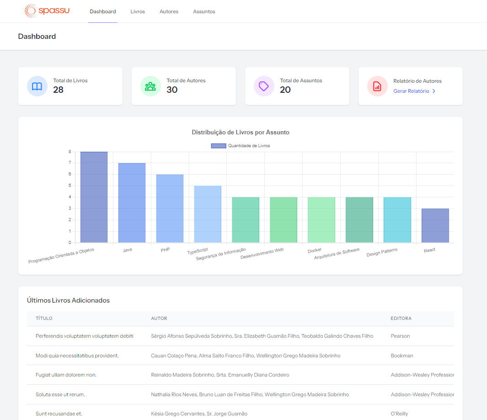

# Spassu Challenge - Sistema de Gerenciamento de Biblioteca



Este projeto é a resolução de um desafio feito pela Spassu que desenvolvido com Laravel e Vue.js, implementando boas práticas de desenvolvimento e padrões de projeto.

## Arquitetura e Padrões de Projeto

- **Command Pattern**: Implementado através dos Form Requests
- **Repository Pattern**: Para abstração da camada de dados
- **Service Pattern**: Para lógica de negócios
- **SOLID Principles**: Especialmente Single Responsibility Principle (SRP)
- **Separation of Concerns**: Separação clara de responsabilidades

## Stack Tecnológica

### Backend

- PHP 8.2
- Laravel Framework ^12.0
- PostgreSQL 15
- Docker & Docker Compose

### Frontend

- Vue.js 3
- TypeScript
- Vite (Bundler)
- TailwindCSS
- Shadcn Vue
- Chart.js
- PrimeVue
- Vue Sonner (Flash Messages)

## Estrutura do Banco de Dados

### Principais Tabelas

- `Assunto`: Categorização dos livros
- `Autor`: Informações dos autores
- `Livro`: Cadastro de livros
- `Livro_Autor`: Relacionamento N:N entre livros e autores
- `Livro_Assunto`: Relacionamento N:N entre livros e assuntos

## Configuração do Ambiente

### Pré-requisitos

- Docker e Docker Compose
- Git
- Node.js (opcional, para desenvolvimento local)

### Passos de Instalação

1. **Clone do Repositório**

```bash
git clone [URL_DO_REPOSITÓRIO]
cd book-challenge
```

2. **Configuração do Docker**

> **Observação**: Dependendo da versão do Docker instalada, você pode usar `docker-compose` (versões mais antigas) ou `docker compose` (versões mais recentes). Ambos os comandos funcionam da mesma forma.

```bash
# Construir e iniciar os containers
docker-compose up -d

# Verificar status dos containers
docker-compose ps
```

3. **Instalação de Dependências**

```bash
# Dependências PHP
docker-compose exec app composer install

# Dependências Node
docker-compose exec node npm install
```

4. **Configuração do Laravel**

```bash
# Configurar ambiente
docker-compose exec app cp .env.example .env
docker-compose exec app php artisan key:generate


Preencha em .env:

DB_CONNECTION=pgsql
DB_HOST=db
DB_PORT=5432
DB_DATABASE=spassu
DB_USERNAME=spassu
DB_PASSWORD=secret

# Executar migrações e seeders
docker-compose exec app php artisan migrate ou docker-compose exec app php artisan migrate --seed
docker-compose exec app php artisan db:seed
```

5. **Compilação de Assets**

```bash
docker-compose exec node npm run build
```

Acessar o sistema

## Estrutura de Diretórios

```
├── app/
│   ├── Http/
│   │   ├── Controllers/
│   │   ├── Requests/
│   │   └── Middleware/
│   ├── Models/
│   ├── Repository/
│   └── Services/
├── resources/
│   ├── js/
│   │   ├── Components/
│   │   ├── Layouts/
│   │   └── Pages/
│   └── views/
├── database/
│   ├── migrations/
│   └── seeders/
└── docker/
    ├── nginx/
    ├── php/
    └── postgres/
```

## Scripts Disponíveis

### PHP (Composer)

```bash
# Testes
docker-compose exec app composer test
docker-compose exec app php artisan test

# Limpeza de Cache
docker-compose exec app php artisan cache:clear
docker-compose exec app php artisan config:clear
docker-compose exec app php artisan view:clear
```

### Node (NPM)

```bash
# Desenvolvimento
docker-compose exec node npm run dev

# Build
docker-compose exec node npm run build

# Formatação
docker-compose exec node npm run format
docker-compose exec node npm run format:check

# Linting
docker-compose exec node npm run format
```

## Monitoramento e Logs

- Logs da aplicação: `storage/logs/laravel.log`
- Logs do Docker: `docker-compose logs -f [serviço]`
- Logs do Nginx: `docker/nginx/logs/`
- Logs do PHP: `docker/php/logs/`
